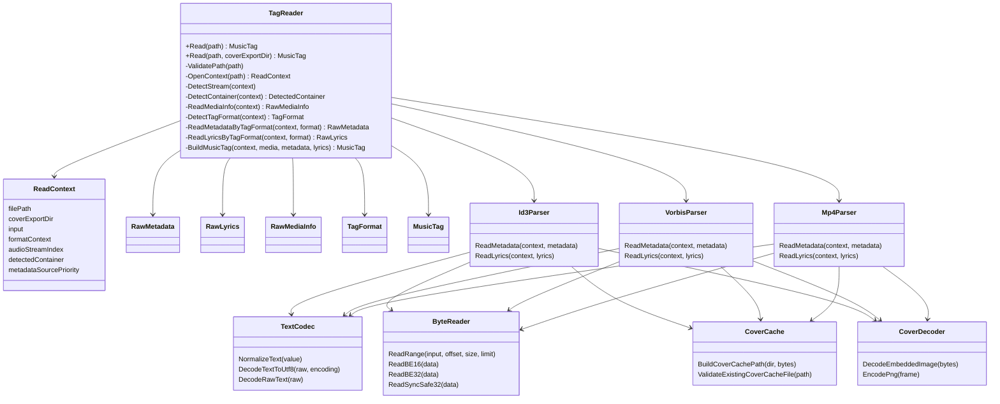

# TagReader 架构重构分析

## 1. 当前架构痛点分析

`TagReader` 当前对外 API 很干净，只有 `TagReader::Read(path)` 和 `TagReader::Read(path, coverExportDir)`，但内部实现集中在 `src/TagReader.cpp`，已经形成典型的 God Class / God Translation Unit。

主要问题不是“缺少设计模式”，而是多个高风险职责被压在同一个文件和同一个类的私有静态函数集合里：

- `TagReader::Read()` 既负责主流程调度，又间接拥有所有格式 parser、文本解码、字节读取、封面缓存和最终装配逻辑。
- ID3、Vorbis/FLAC/Ogg、MP4、歌词、封面块解析混在同一组私有函数声明里，新增或修复某个格式时很容易误触无关分支。
- `NormalizeText()`、`DecodeTextToUtf8()`、`DecodeRawText()`、`ReadRange()`、endian 读取、MP4 atom walker、ID3 unsync 处理等公共能力散落在匿名命名空间中，实际是“隐形基础设施”。
- `ReadContext::input` 是所有原始字节解析共享的 `std::ifstream`，大量 `seekg()` / `read()` 依赖当前错误恢复和边界检查语义，拆分时不能把它当成无状态输入源。
- 封面导出不是普通文件写入，而是 content-addressed PNG cache，包含 hash 分片、已有缓存复用、原子发布、污染缓存校验、mtime 和并发行为约束。
- 当前代码已有多处 `reinterpret_cast` 用于字节/字符串和 C API 边界；目标架构应避免继续扩散这种转换，但不能在第一轮拆分时顺手重写底层解析算法。

因此，这次重构应定义为“安全拆分”，不是“重新设计解析器”。首要目标是降低文件和职责耦合，同时锁住现有解析结果、异常策略、资源限制和副作用边界。

## 2. 目标架构设计

### 2.1 设计原则

- 保持公共 API 不变：调用者仍然只看到 `TagReader::Read(path)` 和 `TagReader::Read(path, coverExportDir)`。
- 保持最终数据结构不变：`MusicTag`、`Lyrics`、字段含义、默认值和输出顺序不变。
- 调整内部主流程表达：FFmpeg 相关媒体层处理完成后，检测当前 `TagFormat`，再按标签格式使用 `switch` / `if` 分发 parser。
- 格式 parser 使用内部 namespace + 统一函数签名，不引入深继承、插件注册、visitor、RTTI 或 `dynamic_cast`。
- 第一阶段只做代码搬迁，不改字节读取、偏移计算、容错判断、字段优先级和文本规范化算法。
- 新增代码禁止引入 `reinterpret_cast`；既有转换点后续通过 `ByteReader` / `TextCodec` 等集中边界逐段替换。

### 2.2 TagFormat 与统一解析器接口

这里需要区分两个概念：

- `ContainerFormat`：媒体/容器层识别结果，例如 MP3、FLAC、Ogg、MP4，主要服务 FFmpeg probe、主音频流和基础媒体信息。
- `TagFormat`：真正决定标签 parser 的格式，例如 ID3v1、ID3v2、VorbisComment、FlacMetadataBlock、OggVorbisComment、Mp4Ilst。

考虑到库偏重性能，格式集合也是静态已知的，不建议设计运行时多态的 `ITagParser` 虚基类。这里的“统一接口”应体现为内部枚举 + 函数签名约定：

```cpp
enum class TagFormat
{
    Unknown,
    Id3v1,
    Id3v2,
    VorbisComment,
    Flac,
    OggVorbis,
    Mp4,
};
```

```cpp
namespace tagreader::id3 {
void ReadMetadata(ReadContext &context, RawMetadata &metadata);
void ReadLyrics(ReadContext &context, RawLyrics &lyrics);
}

namespace tagreader::vorbis {
void ReadMetadata(ReadContext &context, RawMetadata &metadata);
void ReadLyrics(ReadContext &context, RawLyrics &lyrics);
}

namespace tagreader::mp4 {
void ReadMetadata(ReadContext &context, RawMetadata &metadata);
void ReadLyrics(ReadContext &context, RawLyrics &lyrics);
}
```

`TagReader` 或 `TagPipeline` 内部通过 `DetectTagFormat(context)` 得到 `TagFormat`，再使用 `switch` / `if` 分发：

```cpp
switch (format)
{
case TagFormat::Id3v1:
case TagFormat::Id3v2:
    tagreader::id3::ReadMetadata(context, metadata);
    break;
case TagFormat::VorbisComment:
case TagFormat::Flac:
case TagFormat::OggVorbis:
    tagreader::vorbis::ReadMetadata(context, metadata);
    break;
case TagFormat::Mp4:
    tagreader::mp4::ReadMetadata(context, metadata);
    break;
default:
    break;
}
```

这种方式比虚函数层级更适合当前项目：更直接、更快、没有 RTTI，也不会诱导后续使用 `dynamic_cast`。

### 2.3 类图 / 模块关系



### 2.4 交互流程

重构后 `TagReader` 仍然是唯一 facade：

1. `TagReader::Read()` 做路径校验、打开 `ReadContext`，同时建立 FFmpeg 输入上下文和原始文件输入流。
2. `DetectStream()`、`DetectContainer()`、`ReadMediaInfo()` 完成 FFmpeg 相关媒体层处理：主音频流、容器/格式名、时长、采样率、声道、bitrate 等。
3. `DetectTagFormat()` 复用 `ReadContext::input` 读取原始字节，检测真正的标签格式/标签家族。
4. `ReadMetadataByTagFormat()` 根据 `TagFormat` 使用 `switch` / `if` 分发，将具体解析委托给 `id3`、`vorbis`、`flac`、`ogg`、`mp4` 等内部 parser。
5. `ReadLyricsByTagFormat()` 使用同一个 `TagFormat` 分发歌词解析，并在调度层保留容错和最终 `NormalizeLyrics()`。
6. `BuildMusicTag()` 仍然是唯一把 `RawMediaInfo`、`RawMetadata`、`RawLyrics` 写入 `MusicTag` 的位置。

推荐保留当前分发语义：

| TagFormat | 元数据分发 | 歌词分发 |
|---|---|---|
| `Id3v2` | ID3v2，必要时保持现有 ID3v1 补充逻辑 | ID3 lyrics |
| `Id3v1` | ID3v1 | 不解析或保持现有兼容策略 |
| `VorbisComment` | Vorbis comment | Vorbis lyrics |
| `Flac` | FLAC metadata block / Vorbis comment / PICTURE | Vorbis lyrics |
| `OggVorbis` | Ogg Vorbis comment packet | Vorbis lyrics |
| `Mp4` | MP4 atom / ilst | MP4 `©lyr` / freeform lyrics |
| `Unknown` | 保持现有 fallback，例如仅尝试 ID3v1 | 不解析歌词 |

`DetectTagFormat()` 不应只依赖 FFmpeg 容器名，应优先读取文件原始字节标记，例如 ID3 header、FLAC metadata block、Ogg Vorbis comment packet、MP4 atom 结构。所有 parser 复用 `ReadContext::input`，并在入口显式 `clear()` / `seekg()` 到自己需要的位置，避免依赖前一个 parser 留下的 stream position。

## 3. 文件与模块划分计划

用户不希望“所有头文件全放 `include/`，所有源文件全放 `src/`”导致定位困难，因此建议采用“公共 API 极薄 + 内部模块按职责和格式就近组织”的结构。`include/` 只放真正给调用者看的 API；内部 `.hpp` 与对应 `.cpp` 放在 `src/` 子目录中，避免扩大 public surface。

推荐结构：

```text
include/
  TagReader.hpp
  Tag.hpp
  Lyrics.hpp

src/
  core/
    TagReader.cpp            # public facade 的实现，调用 TagPipeline
    TagPipeline.hpp
    TagPipeline.cpp          # Validate/Open/Media/DetectTagFormat/Dispatch/BuildMusicTag 主流程
    ReadContext.hpp          # ReadContext 与 FFmpeg/std::ifstream 生命周期
    RawTagData.hpp           # RawMediaInfo / RawMetadata / RawLyrics / DecodedField
    TagFormat.hpp            # ContainerFormat / TagFormat 内部枚举

  media/
    FfmpegSession.hpp
    FfmpegSession.cpp        # avformat_open_input / close_input / RAII 边界
    MediaInfoReader.hpp
    MediaInfoReader.cpp      # DetectStream / ReadMediaInfo
    ContainerDetector.hpp
    ContainerDetector.cpp    # 文件头 + FFmpeg 容器名识别媒体容器

  io/
    ByteReader.hpp
    ByteReader.cpp           # ReadRange / endian / syncsafe / bounded cursor / seek 状态恢复
    FileReader.hpp
    FileReader.cpp           # 需要时封装复用 ReadContext::input 的读文件操作

  text/
    TextCodec.hpp
    TextCodec.cpp            # DetectTextEncoding / DecodeTextToUtf8 / DecodeRawText
    TextNormalize.hpp
    TextNormalize.cpp        # NormalizeText / NormalizeMetadata / NormalizeLyrics

  cover/
    CoverCache.hpp
    CoverCache.cpp           # hash / content-addressed path / atomic write / existing cache validation
    CoverDecoder.hpp
    CoverDecoder.cpp         # FFmpeg image decode / PNG encode

  formats/
    id3/
      Id3Parser.hpp
      Id3Parser.cpp          # ID3v1 / ID3v2.2 / 2.3 / 2.4 metadata + lyrics + PIC/APIC
      Id3Frames.hpp
      Id3Frames.cpp          # frame id 判断、unsync、extended header、frame payload helper

    vorbis/
      VorbisCommentParser.hpp
      VorbisCommentParser.cpp # Vorbis comment entry + lyrics entry

    flac/
      FlacParser.hpp
      FlacParser.cpp         # FLAC metadata blocks + PICTURE，复用 vorbis comment parser

    ogg-vorbis/
      OggVorbisParser.hpp
      OggVorbisParser.cpp    # Ogg page/packet scanning + comment packet，复用 vorbis comment parser

    mp4/
      Mp4Parser.hpp
      Mp4Parser.cpp          # atom walker / ilst / metadata / covr / lyrics
      Mp4AtomReader.hpp
      Mp4AtomReader.cpp      # atom header、child walk、payload limit、路径状态
```

`formats/` 下必须按标签格式使用子目录拆分；同一个标签格式的 metadata、lyrics、cover block、格式内部 helper 都放在对应子目录中。这样比把 `Id3Parser.*`、`Mp4Parser.*` 平铺在 `src/formats/` 下更容易定位，也避免同一格式的规则被拆散。

`vorbis/` 是一个可复用的标签语义子目录，负责 Vorbis Comment 的 key/value 解析和歌词 entry 处理；`flac/` 与 `ogg-vorbis/` 只处理各自容器里的块/页/包扫描，然后复用 `vorbis/` 的 comment entry 逻辑。

更保守的第一轮结构也可以是：

```text
src/core/TagReader.cpp
src/core/TagPipeline.*
src/core/ReadContext.hpp
src/media/FfmpegMedia.*
src/io/ByteReader.*
src/text/TextCodec.*
src/cover/CoverSupport.*
src/formats/id3/Id3Parser.*
src/formats/vorbis/VorbisCommentParser.*
src/formats/flac/FlacParser.*
src/formats/ogg-vorbis/OggVorbisParser.*
src/formats/mp4/Mp4Parser.*
```

不推荐的结构：

- 不推荐按 `metadata/`、`lyrics/`、`cover/` 横切所有格式；同一格式的规则会散落多个目录，后续维护成本高。
- 不推荐引入 parser 继承树或插件注册表；当前格式集合静态已知，`TagFormat + switch` 更清晰。
- 不推荐把内部头放进 `include/detail/`，除非确实需要跨库边界共享；当前这些类型都应保持库内部细节。

## 4. 分步执行步骤（Action Plan）

### Step 1：建立行为基线，锁定零破坏目标

先不要移动代码。用现有构建目标和代表性样本固定当前行为：

- 构建：`cmake -S . -B build`，然后 `cmake --build build`。
- 人工输出：`./build/TagReaderTest <audio-file-path> [cover-export-dir]`。
- 安全 smoke：`./build/TagReaderSecuritySmoke <cover-export-dir> <audio-file-path> [audio-file-path ...]`。
- 如需 fuzz corpus：`python3 test/corpus/generate_corpus.py`，默认输出 `/tmp/opencode/tagreader_fuzz_corpus`。

基线应覆盖 MP3/ID3、FLAC、Ogg Vorbis、MP4、歌词、封面导出和无封面目录读取。后续每次移动 parser 都要比对 `TagReaderTest` 输出字段、歌词数量、歌词内容、`coverPath`、缓存复用和错误路径。

### Step 2：提取内部数据契约和公共工具，不改 parser 算法

把内部共享类型和公共 helper 先沉到稳定基础层：

- `ReadContext` 进入 `src/core/ReadContext.hpp`，继续同时持有 `std::ifstream input` 和 FFmpeg 上下文。
- `RawMediaInfo`、`RawMetadata`、`RawLyrics`、`DecodedField` 进入 `src/core/RawTagData.hpp`。
- `ContainerFormat`、`TagFormat` 进入 `src/core/TagFormat.hpp`。
- `ReadRange()`、endian 读取、syncsafe 解析、边界检查进入 `src/io/ByteReader.*`。
- `NormalizeText()`、`DetectTextEncoding()`、`DecodeTextToUtf8()`、`DecodeRawText()` 进入 `src/text/TextCodec.*` / `src/text/TextNormalize.*`。
- 封面 hash、cache path、原子写入、已有缓存校验进入 `src/cover/CoverCache.*`，FFmpeg 图片解码/PNG 编码进入 `src/cover/CoverDecoder.*`。

这一步只改变函数归属和 include 关系，不改实现细节。当前已有的 `reinterpret_cast` 点不要在同一提交里重写，避免把“移动代码”和“改算法”混在一起。

### Step 3：按格式族迁移 parser，保持函数体原样

按风险从低到高迁移：

1. `src/formats/id3/`：`ReadID3v1Metadata()`、`ReadID3v2Metadata()`、ID3 frame walker、PIC/APIC、ID3 lyrics。
2. `src/formats/vorbis/`、`src/formats/flac/`、`src/formats/ogg-vorbis/`：Vorbis comment entry、FLAC metadata block、FLAC PICTURE、Ogg page/packet scanning、Vorbis lyrics。
3. `src/formats/mp4/`：atom header、`moov/udta/meta/ilst` walker、metadata item、`covr`、`©lyr`、freeform lyrics。

每个格式族迁移后都立即构建并跑同一套行为基线。不要在迁移中顺手改字段优先级、异常吞吐、resource limit、atom 遍历顺序或歌词归一化。

### Step 4：瘦身 `TagReader`，只保留调度和组装

当格式 parser 已迁出后，收敛 `TagReader.cpp` / `TagPipeline.cpp`：

- `TagReader.cpp` 只保留 public facade 的实现，调用 `TagPipeline`。
- `TagPipeline.cpp` 保留 `ValidatePath()`、`OpenContext()`、`DetectStream()`、`DetectContainer()`、`ReadMediaInfo()`、`DetectTagFormat()`、`ReadMetadataByTagFormat()`、`ReadLyricsByTagFormat()` 和 `BuildMusicTag()` 的流水线。
- FFmpeg probe、stream、media info 细节下沉到 `src/media/`，但由 `TagPipeline` 控制调用顺序。
- 保留 `ReadMetadataByTagFormat()` 和 `ReadLyricsByTagFormat()` 的 `switch` 分发和异常策略。
- 保留 `NormalizeMetadata()` / `NormalizeLyrics()` 的调用点，确保最终收敛语义不变。
- 保留 `BuildMusicTag()` 作为唯一写入 `MusicTag` 的位置。

这一步完成后，`TagReader` 应该是 facade / scheduler / assembler，而不是格式解析实现容器。

### Step 5：在行为锁定后清理转换边界和文档

最后再处理目标设计里的转换约束：

- 新增代码继续禁止 `dynamic_cast`、RTTI 分发、visitor 和深继承。
- 新增 parser 代码不引入 `reinterpret_cast`。
- 旧代码中的字节/字符串边界通过 `ByteReader` / `TextCodec` 逐段替换，替换前后必须跑同一行为基线。
- 更新 `docs/DESIGN.md` 和本分析文档，记录最终模块边界。

## 5. 潜在风险评估

| 风险 | 具体表现 | 缓解措施 |
|---|---|---|
| 行为漂移 | 字段优先级、歌词排序、默认值、异常吞吐或封面路径变化 | 先建立行为基线；每个 parser 迁移后立即比对输出 |
| 抽象过度 | 引入 `ITagParser` 虚基类、插件注册、visitor、RTTI，增加虚调用和生命周期复杂度 | 使用内部 namespace + 统一函数签名；保留 `switch` 静态分发 |
| `ReadContext::input` 状态变化 | parser 共享同一个 `ifstream`，`seekg()` / `clear()` 顺序改变会影响后续读取 | 通过 `ByteReader::ReadRange()` 统一 seek/read/clear 行为；迁移时保持调用顺序 |
| 文本解码不一致 | ID3、Vorbis、MP4 对 UTF-8、UTF-16、Latin-1、BOM、空白处理出现差异 | `TextCodec` 只承接现有实现，不复制多份解码逻辑 |
| 封面副作用扩散 | 未传 `coverExportDir` 时写文件，已有缓存被重写，污染缓存诊断变化 | `CoverCache` 统一缓存副作用，`CoverDecoder` 只负责图片解码/PNG 编码；保留 content-addressed cache、mtime 和错误文案约束 |
| FFmpeg 生命周期错位 | `AVFormatContext`、packet、codec context 被 parser 层持有或释放顺序变化 | FFmpeg 保持在 media/probe/cover decode 层；`AVFormatContext` 仍由 `OpenContext()` 建立并统一释放 |
| MP4 walker 被拆坏 | `Mp4PathState`、`PendingMp4AtomRange`、`WalkMp4IlstItems()` 的状态机语义丢失 | MP4 atom walker 作为整体迁移，不先拆成零散 callback 工具 |
| 转换清理引入解析差异 | 为了禁止 `reinterpret_cast` 顺手改变字节视图、字符串长度或符号解释 | 第一轮只搬移；转换清理单独提交并逐段验证 |
| 大对象拷贝 | parser 接口按值传递 `RawMetadata`、`RawLyrics`、大 buffer 或图片数据 | `ReadContext`、`RawMetadata`、`RawLyrics` 按引用传递；图片 payload 使用 span/view 或现有 buffer 所有权 |
| CMake 目标漂移 | 新增文件未加入 `TagReaderCore`，或测试目标链接行为变化 | 每次新增 `.cpp` 后同步更新 `CMakeLists.txt` 并完整构建 |

## 6. 推荐成功标准

重构完成时应满足：

- `TagReader::Read(path)` 和 `TagReader::Read(path, coverExportDir)` 的签名和行为不变。
- `MusicTag`、`Lyrics`、字段填充和默认值表现不变。
- `TagReaderTest` 对同一批样本输出一致。
- `TagReaderSecuritySmoke` 仍验证封面缓存复用、mtime 不变、并发一致和污染缓存拒绝。
- `TagReader.cpp` 不再承载所有格式 parser，只保留主流程调度、容器分发、异常边界和 `BuildMusicTag()`。
- 格式解析代码按 ID3、Vorbis/FLAC/Ogg、MP4 等内部模块组织。
- 新设计不引入 `dynamic_cast`、RTTI 分发、visitor、深继承或插件式 parser 框架。
- 新增 parser 代码不引入 `reinterpret_cast`，旧转换点通过共享工具逐步收敛。
